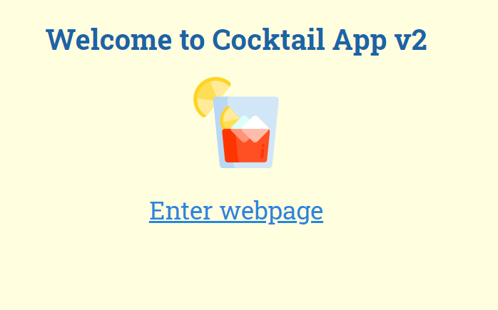
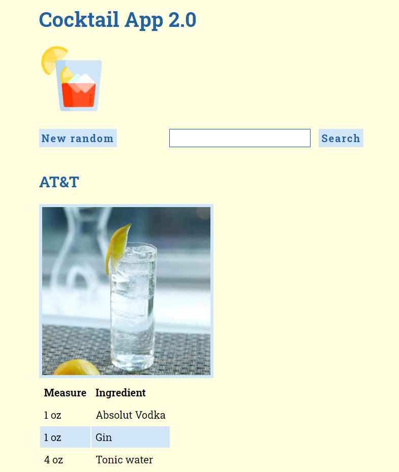

# Cocktail App v2

The project can retrieve information about drinks and cocktails from [TheCocktailDB](https://www.thecocktaildb.com/).

There are two features in this project:

- get a random cocktail on reload and on clicking
- search for a specific cocktail by name

This is a remake of my earlier Cocktail app. This new version features:

* TypeScript React and
* functional components with hooks
* components
* more styles with custom properties (variables)

Please see [the exercise description of the project for details.](EXERCISE.md)

## Running the app

1. `npm install`
2. `npm start`

## Screenshot

The app looks like this.

## License

Please read [the license file.](LICENSE)